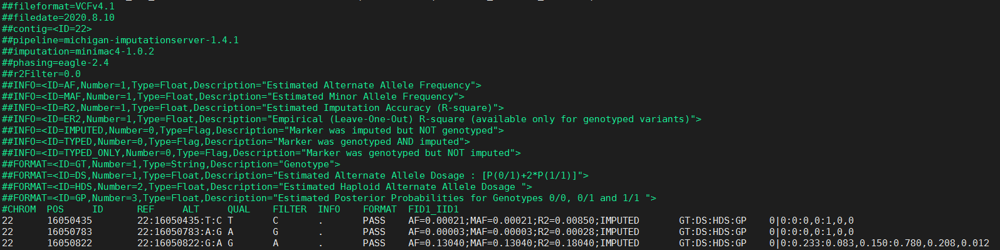

# PLINK2 for unrelated individuals

## Background

On this page you will know how to run GWAS in unrelated individuals using the popular genetic analyses tool `PLINK2`_._  Here we use blood pressure \(BP\) trait as example.

## Required Data

<table>
  <thead>
    <tr>
      <th style="text-align:left">File name</th>
      <th style="text-align:left">File type</th>
      <th style="text-align:left">Description</th>
    </tr>
  </thead>
  <tbody>
    <tr>
      <td style="text-align:left">BP_phenotypes.csv</td>
      <td style="text-align:left">phenotype data</td>
      <td style="text-align:left">can be in other formats (e.g. spss, txt)</td>
    </tr>
    <tr>
      <td style="text-align:left">PCAresult.eigenvec</td>
      <td style="text-align:left">PCA data</td>
      <td style="text-align:left">This file contains the first 20 PCs of samples</td>
    </tr>
    <tr>
      <td style="text-align:left">
        <p>chr1.dose.vcf.gz ...</p>
        <p>chr22.dose.vcf.gz</p>
      </td>
      <td style="text-align:left">imputed data (VCF file)</td>
      <td style="text-align:left">1000G or HRC imputation data, include dosage of markers</td>
    </tr>
    <tr>
      <td style="text-align:left">chr1.info.gz ... chr22.info.gz</td>
      <td style="text-align:left">info data along with imputed data</td>
      <td style="text-align:left">This file contains imputation quality score of markers</td>
    </tr>
  </tbody>
</table>

use `zcat chr22.dose.vcf.gz | cut -f1-10 | more` to inspect dose.vcf.gz file.



## Preparation for analyses

Always check guidelines from analyses plan before running GWAS. We may need to do some individual exclusions and stratified analyses. 

For example, in our meta-GWAS of child BP project, we should exclude**:**  

1. individuals&gt;=18 years of age. 
2. reported cases of hypertension \(children with a diagnose and thereby treatment\). 

In addition, stratified analyses are required:

1. Ethnicity: Perform all analyses stratified by ethnicity \(Caucasians/Europeans, African Americans, etc.\) if you have data from different ethnicity. 
2. Gender based: Perform analyses stratifying for sex, separately in males and females as well as a combined analyses, pooling all. 

## Step 1 Prepare Phenotype

Before running GWAS, we always need to prepare phenotype \(e.g. trait transformation\). According to the analyses plan of our meta-GWAS project, we should do the following trait transformation:

1. Calculate residuals by running this regression model for each trait separately in males and females: Trait \(SBP/DBP/MAP/PP/HR\) ~ age + height + PCs \(if available\) + \(study specific covariates if required\)
2. Perform rank-based Inverse Normal transformation of these residuals

Here I present a example of R code for preparing phenotype. The R code follows steps: 

1. import **phenotype data** and **PCA data** \(for next GWAS, we should keep FID and IID variable in correspondence with genotype data\) 
2. merge phenotype and PCA, by this we can also select individuals with both phenotype and genotype
3. here we can describe phenotype \(mean, sd\) for supplementary table
4. trait transformation \(rank-based Inverse Normal transformation residuals\) in males and females separately
5. export data for GWAS \(**"pheno\_pooled\_invBP.txt", "pheno\_males\_invBP.txt", "pheno\_females\_invBP.txt"**\)

Three R packages are used to increase the efficiency:

* package `data.table`, function `fread` and `fwrite` can import and export data faster and more convenient. [https://www.rdocumentation.org/packages/data.table/versions/1.13.0/topics/fread](https://www.rdocumentation.org/packages/data.table/versions/1.13.0/topics/fread) 
* package `dplyr`, which is useful in data manipulation \(e.g. function `mutate` for creating new variables\). [https://dplyr.tidyverse.org/reference/](https://dplyr.tidyverse.org/reference/)
* package `tableone`,  which eases the construction of “Table 1”, _i.e._, individuals characteristics table commonly found in supplementary tables of meta-GWAS paper \(used in step 3\). [https://cran.r-project.org/web/packages/tableone/vignettes/introduction.html](https://cran.r-project.org/web/packages/tableone/vignettes/introduction.html)


```r
library(data.table) 
library(dplyr)
library(tableone)

##### Step 1 data input (keep FID and IID variable for GWAS)
pheno<-fread("BP_phenotypes.csv")  #ID,Age,Sex(1-males,2-females),Height,Weight,SBP,DBP,HR
colnames(pheno)<-c("IID","Age","Sex","Height","Weight","SBP","DBP","HR")  
pheno<-pheno%>% mutate(PP=SBP-DBP,MAP=1/3*SBP+2/3*DBP)

PCA<-fread("PCAresult.eigenvec")
colnames(PCA)<-c("FID","IID",paste0("PC",1:20))
PCA<-PCA[,1:12]

##### Step 2 merge phenotype and PCA
pheno_forGWAS<-merge(pheno,PCA,by="IID")

##### Step 3 describe phenotype (mean, sd) for supplementary table
tableone_pheno<-cbind(print(CreateTableOne(data = pheno_forGWAS[,c("Age","Height","Sex","SBP","DBP","PP","MAP","HR")])),print(CreateTableOne(strata = "Sex", data = pheno_forGWAS[,c("Age","Height","Sex","SBP","DBP","PP","MAP","HR")])))
write.csv(tableone_pheno,"phenotype_tableone.csv")

##### Step 4 Trait transformation (Inverse Normal transformation of residuals)
pheno_males<-filter(pheno_forGWAS,Sex==1)
pheno_females<-filter(pheno_forGWAS,Sex==2)

compute_INR<-function(pheno,dataset){
resid_linear=residuals(lm(pheno~Age+Height+PC1+PC2+PC3+PC4+PC5+PC6+PC7+PC8+PC9+PC10,data=dataset))
inv_pheno=qnorm((rank(resid_linear,na.last="keep")-0.5)/sum(!is.na(resid_linear)))
return(inv_pheno)}

pheno_males<- pheno_males %>% mutate(inv_SBP=compute_INR(SBP,pheno_males),inv_DBP=compute_INR(DBP,pheno_males),inv_MAP=compute_INR(MAP,pheno_males),inv_PP=compute_INR(PP,pheno_males),inv_HR=compute_INR(HR,pheno_males))
pheno_females<- pheno_females %>% mutate(inv_SBP=compute_INR(SBP,pheno_females),inv_DBP=compute_INR(DBP,pheno_females),inv_MAP=compute_INR(MAP,pheno_females),inv_PP=compute_INR(PP,pheno_females),inv_HR=compute_INR(HR,pheno_females))

pheno_males_invBP<-pheno_males %>% select(FID,IID,inv_SBP:inv_HR)
pheno_females_invBP<-pheno_females %>% select(FID,IID,inv_SBP:inv_HR)
pheno_pooled_invBP<-rbind(pheno_males_invBP,pheno_females_invBP)

##### Step 5 export data for GWAS  
fwrite(pheno_pooled_invBP,file="pheno_pooled_invBP.txt",sep="\t")
fwrite(pheno_males_invBP,file="pheno_males_invBP.txt",sep="\t")
fwrite(pheno_females_invBP,file="pheno_females_invBP.txt",sep="\t")
```


## Step 2 Run GWAS

We use the rank based inverse normal transformed data to run the association testing with the SNPs for each individual trait, as below: 

### Models to be run 

1. All individuals \(pool the inverse normal values calculated for males and females separately\) `Outcome (inv_SBP/inv_DBP/inv_PP/inv_MAP/inv_HR) ~ SNP` 

2. In Males `Outcome (inv_SBP/inv_DBP/inv_PP/inv_MAP/inv_HR) ~ SNP` 

3. In Females `Outcome (inv_SBP/inv_DBP/inv_PP/inv_MAP/inv_HR) ~ SNP` 

### PLINK2 to run models

`PLINK2` is used to run above models and all analyses are conducted in the computer cluster of  University of Groningen \([https://wiki.hpc.rug.nl/peregrine/start](https://wiki.hpc.rug.nl/peregrine/start)\) based on Linux operating system \(A beginners guide [http://www.ee.surrey.ac.uk/Teaching/Unix/](http://www.ee.surrey.ac.uk/Teaching/Unix/)\). 

First we use `module load` to load PLINK2 and create \(`mkdir`\) a sub-folder "GWAS\_results". Secondly we print the first two columns \(`awk '{print $1,$2}'`\) of the phenotype file, which contains FID and IID of samples used for GWAS. Finally we run GWAS using PLINK2 and store the results in the folder "GWAS\_results" \(PLINK2 [https://www.cog-genomics.org/plink/2.0](https://www.cog-genomics.org/plink/2.0)\). 

Below is the example for running models in all individuals for one chromosome. We can further use `for` loop to run models for all chromosomes.




```bash
module load PLINK/2.00-alpha2.1-foss-2018a
mkdir GWAS_results
awk '{print $1,$2}' pheno_pooled_invBP.txt > pheno_pooled_sample.txt

plink2 \
--vcf chr22.dose.vcf.gz dosage=DS \
--id-delim \
--keep pheno_pooled_sample.txt \
--missing variant-only \
--freq \
--hardy \
--pheno pheno_pooled_invBP.txt \
--pheno-name inv_SBP inv_DBP inv_PP inv_MAP inv_HR\
--glm omit-ref \
--out GWAS_results/BP_pooled_chr22
```





```bash
module load PLINK/2.00-alpha2.1-foss-2018a
mkdir GWAS_results
awk '{print $1,$2}' pheno_pooled_invBP.txt > pheno_pooled_sample.txt

for i in {1..22}
do
plink2 \
--vcf chr$i.dose.vcf.gz dosage=DS \
--id-delim \
--keep pheno_pooled_sample.txt \
--missing variant-only \
--freq \
--hardy \
--pheno pheno_pooled_invBP.txt \
--pheno-name inv_SBP inv_DBP inv_PP inv_MAP inv_HR\
--glm omit-ref \
--out GWAS_results/BP_pooled_chr$i
done
```




The meaning of the options in PLINK2:

| Option | Description | Output file |
| :--- | :--- | :--- |
| --vcf chr22.dose.vcf.gz dosage=DS | to load the allele dosages from the vcf file |  |
| --id-delim | to tell PLINK2 that sample ID in VCF file is FID\_IID |  |
| --keep pheno\_pooled\_sample.txt | to keep individuals we want to analyze |  |
| --missing variant-only | to report variants missing data | BP\_pooled\_chr22.vmiss |
| --freq | to calculate allele frequency | BP\_pooled\_chr22.afreq |
| --hardy | to calculate HWE p value | BP\_pooled\_chr22.hardy |
| --pheno pheno\_pooled\_invBP.txt | to load phenol file |  |
| --pheno-name inv\_SBP inv\_DBP inv\_PP inv\_MAP | to set phenotype to be analyzed |  |
| --glm omit-ref | to perform a generalized linear model analysis and use `omit-ref` to force plink2 to treat ALT allele as effect allele, otherwise minor allele is used as effect allele | BP\_pooled\_chr22.inv\_SBP.glm.linear, BP\_pooled\_chr22.inv\_DBP.glm.linear, BP\_pooled\_chr22.inv\_MAP.glm.linear, BP\_pooled\_chr22.inv\_PP.glm.linear |
| --out GWAS\_results/BP\_pooled\_chr22 | to set the output file |  |


VCF files just contain sample IDs, instead of the distinct family and individual IDs tracked by PLINK.  It may be necessary to use [--double-id/--const-fid/--id-delim](https://www.cog-genomics.org/plink/2.0/input#sample_id_convert) to convert sample IDs to family ID \(FID\) and individual ID \(IID\).

`--double-id` convert  sample IDs to both FIDs and IIDs.

`--const-fid` converts sample IDs to IID while setting all FIDs to a single value \(default '0'\).

`--id-delim` normally causes single-delimiter sample IDs to be parsed as &lt;FID&gt;&lt;delimiter&gt;&lt;IID&gt;, the default delimiter is '\_'. In our example, we use `--id-delim` as our sample ID in VCF file is FID\_IID \(usually in HRC imputation by Michigan imputation server\).



In VCF file, genotype data has four different field separated by ":". These four fields are:

* **GT** - Estimated most likely genotype.
* **DS** - Estimated alternate allele dosage \[P\(0/1\)+2\*P\(1/1\)\].
* **HDS** - Estimated phased haploid alternate allele dosage.
* **GP** - Estimated Posterior Genotype Probabilities P\(0/0\), P\(0/1\) and P\(1/1\).

The difference between DS and HDS is that DS is unphased and HDS is phased. However, --glm does not care about genotype/dosage phase; so here we still use **dosage=DS**. 


### GWAS results output

PLINK2 produce four types of result files:

* Results of GWAS \(e.g. BP\_pooled\_chr22.inv\_SBP.glm.linear\) including 12 columns: \#CHROM, POS, ID, REF, ALT, A1, TEST, OBS\_CT \(Number of samples\), **BETA**, **SE**, T\_STAT, **P**. [https://www.cog-genomics.org/plink/2.0/formats\#glm\_linear](https://www.cog-genomics.org/plink/2.0/formats#glm_linear)
* Allele frequency file \(BP\_pooled\_chr22.afreq\) including 6columns: \#CHROM, ID, REF,  ALT, **ALT\_FREQS** \(AF of alternative allele\), OBS\_CT. 
* Callrate file \(BP\_pooled\_chr22.vmiss\) including 5 columns: \#CHROM, ID, MISSING\_CT, OBS\_CT, **F\_MISS \(CALLRATE=1-F\_MISS\)**
* HWE file \(BP\_pooled\_chr22.hardy\) including Hardy-Weinberg equilibrium exact test p-value \(column name _P_\).   

## Step 3 Extract imputation quality from imputed data

PLINK2 cannot produce imputation quality file, so we have to extract information on imputation quality from **info.gz** file or **dose.vcf.gz** file. 

* From **info.gz** file, print column 1st \(SNP ID\), 7th \(Rsq, estimated imputation accuracy\), 8th \(Genotyped, indicating genotyped or imputed\).

```r
zcat chr22.info.gz | awk 'BEGIN {FS=OFS="\t"} {print $1,$7,$8}' > GWAS_results/info_Rsq_chr22
```

* If you don't have info.gz file, we can still extract imputation quality from **dose.vcf.gz** file using `vcftools`. [https://vcftools.github.io/man\_latest.html\#OUTPUT%20OPTIONS](https://vcftools.github.io/man_latest.html#OUTPUT%20OPTIONS)

```r
module load VCFtools/0.1.16-foss-2018b-Perl-5.28.0
vcftools --gzvcf chr22.dose.vcf.gz --get-INFO R2 --out GWAS_results/info_Rsq_chr22
```

## Step 4 Merge all results

Now, we have generated all results in "GWAS\_results" folder, next is to merge all results. 

### Merge all chromosomes

In step 2 and 3, we use for loop to run GWAS and extract imputation quality info for every chromosome, and now we need to merge results of all chromosomes. Please note: all files have a header containing column names, we should keep only one header and remove headers of other files. 

Taking SBP result as example, the merging process includes the following steps:

1. First we use `head -n 1` to save the first line \(header\) to "SBP\_pooled\_linear\_result" file.
2. Then we use `sed '1d'` to delete the header of every chromosome result. 
3. Finally we use `cat >>` to append contents of every chromosome result at the end of "SBP\_pooled\_linear\_result" file.


```r
cd GWAS_results  #go to the results folder
 
#keep header
head -n 1 BP_pooled_chr1.inv_SBP.glm.linear > SBP_pooled_linear_result
head -n 1 BP_pooled_chr1.inv_DBP.glm.linear > DBP_pooled_linear_result
head -n 1 BP_pooled_chr1.inv_MAP.glm.linear > MAP_pooled_linear_result
head -n 1 BP_pooled_chr1.inv_PP.glm.linear > PP_pooled_linear_result
head -n 1 BP_pooled_chr1.inv_HR.glm.linear > HR_pooled_linear_result
head -n 1 info_Rsq_chr1 > imputation_quality
head -n 1 BP_pooled_chr1.afreq > BP_pooled_EAF
head -n 1 BP_pooled_chr1.vmiss > BP_pooled_callrate
head -n 1 BP_pooled_chr1.hardy > BP_pooled_hwe

#merge all chromosomes
for i in {1..22}
do
sed '1d' BP_pooled_chr$i.inv_SBP.glm.linear | cat >> SBP_pooled_linear_result
sed '1d' BP_pooled_chr$i.inv_DBP.glm.linear | cat >> DBP_pooled_linear_result
sed '1d' BP_pooled_chr$i.inv_MAP.glm.linear | cat >> MAP_pooled_linear_result
sed '1d' BP_pooled_chr$i.inv_PP.glm.linear | cat >> PP_pooled_linear_result
sed '1d' BP_pooled_chr$i.inv_HR.glm.linear | cat >> HR_pooled_linear_result
sed '1d' info_Rsq_chr$i | cat >> imputation_quality
sed '1d' BP_pooled_chr$i.afreq | cat >> BP_pooled_EAF
sed '1d' BP_pooled_chr$i.vmiss | cat >> BP_pooled_callrate
sed '1d' BP_pooled_chr$i.hardy | cat >> BP_pooled_hwe
done
```


### Merge all files using R 

As we have five types of files containing all chromosomes \(linear\_result, imputation\_quality, EAF, callrate, hwe files\), last step is to merge these files into one file and adapt data upload format according to the analyses plan. 

Here I present a example of R code for merging files. Before merging, we should always check carefully what columns every type of file has, which columns we need and which column can be used to merge files.  

Two R packages are used to increase the efficiency:

* package `data.table` to import and export data faster and more convenient, especially for large dataset. 
* package `dplyr` for data manipulation \(e.g. function `mutate` to create new variables, `select` to select variables we need, `left_join` to merge data \(includes all rows in the first file\)\). 


```r
library(data.table)
library(dplyr)

c<-c("pooled","males","females")
for (i in 1:3) {
#import data and rename columns
SBP_linear<-fread(paste0("SBP_",c[i],"_linear_result"))
DBP_linear<-fread(paste0("DBP_",c[i],"_linear_result"))
MAP_linear<-fread(paste0("MAP_",c[i],"_linear_result"))
PP_linear<-fread(paste0("PP_",c[i],"_linear_result"))
HR_linear<-fread(paste0("HR_",c[i],"_linear_result"))
headername<-c("CHR","POS","ID","OTHER_ALLELE","EFFECT_ALLELE","A1","TEST","N","BETA","SE","T_STAT","P")
colnames(SBP_linear)<-headername
colnames(DBP_linear)<-headername
colnames(MAP_linear)<-headername
colnames(PP_linear)<-headername
colnames(HR_linear)<-headername

EAF<-fread(paste0("BP_",c[i],"_EAF"))
EAF<-EAF %>% select(ID,ALT_FREQS) %>% rename(EAF=ALT_FREQS)
callrate<-fread(paste0("BP_",c[i],"_callrate"))
callrate<-callrate %>% mutate(CALLRATE=1-F_MISS) %>% select(ID,CALLRATE)
hwe<-fread(paste0("BP_",c[i],"_hwe"))
hwe<-hwe %>% select(ID,P) %>% rename(P_HWE=P)
impute<-fread("imputation_quality")
colnames(impute)<-c("ID","INFO","INFO_TYPE")

#merge files
SBP_results<-SBP_linear %>% left_join(EAF,by="ID") %>% left_join(hwe,by="ID")%>% left_join(callrate,by="ID")%>% left_join(impute,by="ID") %>% mutate(MARKER=paste0(CHR,":",POS),STRAND="+",BUILD="37.1") %>% select(MARKER,STRAND,CHR,BUILD,POS,N,EFFECT_ALLELE,OTHER_ALLELE,EAF,BETA,SE,P,P_HWE,CALLRATE,INFO_TYPE,INFO)
DBP_results<-DBP_linear %>% left_join(EAF,by="ID") %>% left_join(hwe,by="ID")%>% left_join(callrate,by="ID")%>% left_join(impute,by="ID") %>% mutate(MARKER=paste0(CHR,":",POS),STRAND="+",BUILD="37.1") %>% select(MARKER,STRAND,CHR,BUILD,POS,N,EFFECT_ALLELE,OTHER_ALLELE,EAF,BETA,SE,P,P_HWE,CALLRATE,INFO_TYPE,INFO)
MAP_results<-MAP_linear %>% left_join(EAF,by="ID") %>% left_join(hwe,by="ID")%>% left_join(callrate,by="ID")%>% left_join(impute,by="ID") %>% mutate(MARKER=paste0(CHR,":",POS),STRAND="+",BUILD="37.1") %>% select(MARKER,STRAND,CHR,BUILD,POS,N,EFFECT_ALLELE,OTHER_ALLELE,EAF,BETA,SE,P,P_HWE,CALLRATE,INFO_TYPE,INFO)
PP_results<-PP_linear %>% left_join(EAF,by="ID") %>% left_join(hwe,by="ID")%>% left_join(callrate,by="ID")%>% left_join(impute,by="ID") %>% mutate(MARKER=paste0(CHR,":",POS),STRAND="+",BUILD="37.1") %>% select(MARKER,STRAND,CHR,BUILD,POS,N,EFFECT_ALLELE,OTHER_ALLELE,EAF,BETA,SE,P,P_HWE,CALLRATE,INFO_TYPE,INFO)
HR_results<-HR_linear %>% left_join(EAF,by="ID") %>% left_join(hwe,by="ID")%>% left_join(callrate,by="ID")%>% left_join(impute,by="ID") %>% mutate(MARKER=paste0(CHR,":",POS),STRAND="+",BUILD="37.1") %>% select(MARKER,STRAND,CHR,BUILD,POS,N,EFFECT_ALLELE,OTHER_ALLELE,EAF,BETA,SE,P,P_HWE,CALLRATE,INFO_TYPE,INFO)

#export data
fwrite(SBP_results,file=paste0("SBP_",c[i],"_EA_250920_TX.txt"),sep="\t")
fwrite(DBP_results,file=paste0("DBP_",c[i],"_EA_250920_TX.txt"),sep="\t")
fwrite(MAP_results,file=paste0("MAP_",c[i],"_EA_250920_TX.txt"),sep="\t")
fwrite(PP_results,file=paste0("PP_",c[i],"_EA_250920_TX.txt"),sep="\t")
fwrite(HR_results,file=paste0("HR_",c[i],"_EA_250920_TX.txt"),sep="\t")
}
```


## Summary

In summary, to run GWAS in unrelated individuals, we need to 1\) prepare phenotype, 2\) run GWAS using PLINK2, 3\) extract imputation quality, 4\) merge all results. 

For the sake of convenience and efficiency, we put all these four steps in one shell script \(see below GWAS\_pipeline.sh\) and execute it in the cluster \([https://wiki.hpc.rug.nl/peregrine/start](https://wiki.hpc.rug.nl/peregrine/start)\). In practice, we need to:

1. Put all required data \(phenotype and PCA data, imputed data \(VCF\) and info data\) and all scripts \(GWAS\_pipeline.sh, prepare\_phenotype.R, merge\_results.R\) in the same folder in the cluster.
2. Execute the shell script using the command `sbatch GWAS_pipeline.sh`

It may take from several hours to a few days for the cluster to finish the analyses. Then we can find all compressed results \(e.g. SBP\_pooled\_EA\_250920\_TX.txt.gz\) in the subfolder **GWAS\_results**. In this way, we can easily reproduce our results by just typing one command `sbatch GWAS_pipeline.sh`.


```bash
#!/bin/bash
#SBATCH --time=16:00:00
#SBATCH --nodes=1
#SBATCH --cpus-per-task=1
#SBATCH --mem=95G
#SBATCH --job-name=GWAS_pipeline
#SBATCH --export=NONE
#SBATCH --get-user-env=L60

#### Name: Tian Xie
#### Date: 20200928
#### Project: GWAS pipeline 

module load PLINK/2.00-alpha2.1-foss-2018a      #load PLINK2
module load R/3.6.1-foss-2018a                  #load R

mkdir GWAS_results                  #create a subfolder to store the results
cp merge_results.R ./GWAS_results/  #copy Rscript to subfolder

#################################################### GWAS pipeline
## step 1 prepare phenotype
## step 2 run GWAS using PLINK2
## step 3 extract imputation quality from HRC imputed data
## step 4 merge all results

######################### Step 1 prepare phenotype

#using R to deal with phenotype 
Rscript prepare_phenotype.R

######################### Step 2 run GWAS using PLINK2 (for pooled, males and females)

awk '{print $1,$2}' pheno_pooled_invBP.txt > pheno_pooled_sample.txt
awk '{print $1,$2}' pheno_males_invBP.txt > pheno_males_sample.txt
awk '{print $1,$2}' pheno_females_invBP.txt > pheno_females_sample.txt

for i in {1..22} 
do
plink2 --vcf chr$i.dose.vcf.gz dosage=DS --id-delim \
--keep pheno_pooled_sample.txt --missing variant-only --freq --hardy \
--pheno pheno_pooled_invBP.txt \
--pheno-name inv_SBP inv_DBP inv_PP inv_MAP inv_HR\
--glm omit-ref \
--out GWAS_results/BP_pooled_chr$i

plink2 --vcf chr$i.dose.vcf.gz dosage=DS --id-delim \
--keep pheno_males_sample.txt --missing variant-only --freq --hardy \
--pheno pheno_males_invBP.txt \
--pheno-name inv_SBP inv_DBP inv_PP inv_MAP inv_HR\
--glm omit-ref \
--out GWAS_results/BP_males_chr$i

plink2 --vcf chr$i.dose.vcf.gz dosage=DS --id-delim \
--keep pheno_females_sample.txt --missing variant-only --freq --hardy \
--pheno pheno_females_invBP.txt \
--pheno-name inv_SBP inv_DBP inv_PP inv_MAP inv_HR\
--glm omit-ref \
--out GWAS_results/BP_females_chr$i

######################### step 3 extract imputation quality from HRC imputed data

zcat chr$i.info.gz | awk 'BEGIN {FS=OFS="\t"} {print $1,$7,$8}'\
> GWAS_results/info_Rsq_chr$i
done

######################### step 4 merge all results
cd GWAS_results                #go to the subfolder which store the results

## first merge all chromosomes 
## Note: keep header of chr1 and remove headers in other chromosomes
#keep header
head -n 1 BP_pooled_chr1.inv_SBP.glm.linear > SBP_pooled_linear_result
head -n 1 BP_pooled_chr1.inv_DBP.glm.linear > DBP_pooled_linear_result
head -n 1 BP_pooled_chr1.inv_MAP.glm.linear > MAP_pooled_linear_result
head -n 1 BP_pooled_chr1.inv_PP.glm.linear > PP_pooled_linear_result
head -n 1 BP_pooled_chr1.inv_HR.glm.linear > HR_pooled_linear_result

head -n 1 BP_males_chr1.inv_SBP.glm.linear > SBP_males_linear_result
head -n 1 BP_males_chr1.inv_DBP.glm.linear > DBP_males_linear_result
head -n 1 BP_males_chr1.inv_MAP.glm.linear > MAP_males_linear_result
head -n 1 BP_males_chr1.inv_PP.glm.linear > PP_males_linear_result
head -n 1 BP_males_chr1.inv_HR.glm.linear > HR_males_linear_result

head -n 1 BP_females_chr1.inv_SBP.glm.linear > SBP_females_linear_result
head -n 1 BP_females_chr1.inv_DBP.glm.linear > DBP_females_linear_result
head -n 1 BP_females_chr1.inv_MAP.glm.linear > MAP_females_linear_result
head -n 1 BP_females_chr1.inv_PP.glm.linear > PP_females_linear_result
head -n 1 BP_females_chr1.inv_HR.glm.linear > HR_females_linear_result

head -n 1 info_Rsq_chr1 > imputation_quality
head -n 1 BP_pooled_chr1.afreq > BP_pooled_EAF
head -n 1 BP_pooled_chr1.vmiss > BP_pooled_callrate
head -n 1 BP_pooled_chr1.hardy > BP_pooled_hwe
head -n 1 BP_males_chr1.afreq > BP_males_EAF
head -n 1 BP_males_chr1.vmiss > BP_males_callrate
head -n 1 BP_males_chr1.hardy > BP_males_hwe
head -n 1 BP_females_chr1.afreq > BP_females_EAF
head -n 1 BP_females_chr1.vmiss > BP_females_callrate
head -n 1 BP_females_chr1.hardy > BP_females_hwe

#merge all chromosomes
for i in {1..22}
do
sed '1d' BP_pooled_chr$i.inv_SBP.glm.linear | cat >> SBP_pooled_linear_result
sed '1d' BP_pooled_chr$i.inv_DBP.glm.linear | cat >> DBP_pooled_linear_result
sed '1d' BP_pooled_chr$i.inv_MAP.glm.linear | cat >> MAP_pooled_linear_result
sed '1d' BP_pooled_chr$i.inv_PP.glm.linear | cat >> PP_pooled_linear_result
sed '1d' BP_pooled_chr$i.inv_HR.glm.linear | cat >> HR_pooled_linear_result
sed '1d' BP_males_chr$i.inv_SBP.glm.linear | cat >> SBP_males_linear_result
sed '1d' BP_males_chr$i.inv_DBP.glm.linear | cat >> DBP_males_linear_result
sed '1d' BP_males_chr$i.inv_MAP.glm.linear | cat >> MAP_males_linear_result
sed '1d' BP_males_chr$i.inv_PP.glm.linear | cat >> PP_males_linear_result
sed '1d' BP_males_chr$i.inv_HR.glm.linear | cat >> HR_males_linear_result
sed '1d' BP_females_chr$i.inv_SBP.glm.linear | cat >> SBP_females_linear_result
sed '1d' BP_females_chr$i.inv_DBP.glm.linear | cat >> DBP_females_linear_result
sed '1d' BP_females_chr$i.inv_MAP.glm.linear | cat >> MAP_females_linear_result
sed '1d' BP_females_chr$i.inv_PP.glm.linear | cat >> PP_females_linear_result
sed '1d' BP_females_chr$i.inv_HR.glm.linear | cat >> HR_females_linear_result

sed '1d' info_Rsq_chr$i | cat >> imputation_quality

sed '1d' BP_pooled_chr$i.afreq | cat >> BP_pooled_EAF
sed '1d' BP_pooled_chr$i.vmiss | cat >> BP_pooled_callrate
sed '1d' BP_pooled_chr$i.hardy | cat >> BP_pooled_hwe
sed '1d' BP_males_chr$i.afreq | cat >> BP_males_EAF
sed '1d' BP_males_chr$i.vmiss | cat >> BP_males_callrate
sed '1d' BP_males_chr$i.hardy | cat >> BP_males_hwe
sed '1d' BP_females_chr$i.afreq | cat >> BP_females_EAF
sed '1d' BP_females_chr$i.vmiss | cat >> BP_females_callrate
sed '1d' BP_females_chr$i.hardy | cat >> BP_females_hwe
done

##use R to merge linear_results, imputation_quality, EAF, callrate, hwe into one file
Rscript merge_results.R

gzip *EA_250920_TX.txt  #gzip the final result files

# remove results of each chromosome to increase the space
rm *linear *hardy *afreq *vmiss info_Rsq* *hwe *callrate *EAF *linear_result imputation_quality

```


