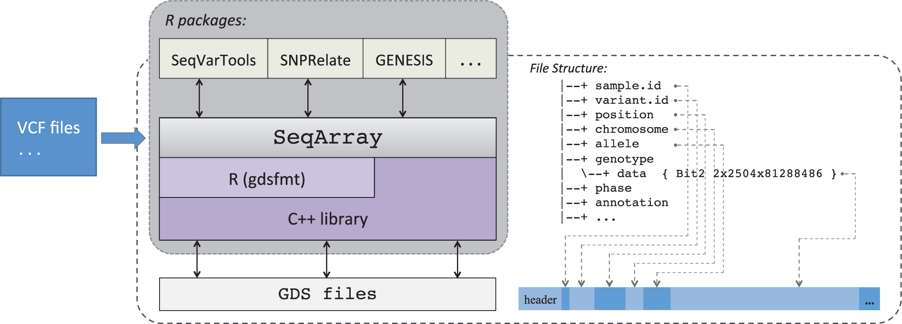

# SAIGEgds for related individuals

## Background

On this page you will know how to run GWAS in related individuals using the R package `SAIGEgds` .  

`SAIGEgds`  leverages the Genomic Data Structure \(GDS\) format to provide efficient mixed-model analyses which allow for adjusting family relatedness. See more details in below papers and tutorials.

**Paper** 

**SAIGEgds** \(Zheng et al, 2020\) [https://doi.org/10.1093/bioinformatics/btaa731](https://doi.org/10.1093/bioinformatics/btaa731)\*\*\*\*

**SAIGE** \(Zhou et al, 2018\) [https://www.nature.com/articles/s41588-018-0184-y](https://www.nature.com/articles/s41588-018-0184-y) 

**Tutorial** 

\*\*\*\*[http://www.bioconductor.org/packages/devel/bioc/vignettes/SAIGEgds/inst/doc/SAIGEgds.htm](http://www.bioconductor.org/packages/devel/bioc/vignettes/SAIGEgds/inst/doc/SAIGEgds.html)[https://bioconductor.riken.jp/packages/3.10/bioc/manuals/SAIGEgds/man/SAIGEgds.pdf](https://bioconductor.riken.jp/packages/3.10/bioc/manuals/SAIGEgds/man/SAIGEgds.pdf)

## Required Data

<table>
  <thead>
    <tr>
      <th style="text-align:left">File name</th>
      <th style="text-align:left">File type</th>
      <th style="text-align:left">Description</th>
    </tr>
  </thead>
  <tbody>
    <tr>
      <td style="text-align:left">BP_phenotypes.csv</td>
      <td style="text-align:left">phenotype data</td>
      <td style="text-align:left">can be in other formats (e.g. spss, txt)</td>
    </tr>
    <tr>
      <td style="text-align:left">PCAresult.eigenvec</td>
      <td style="text-align:left">PCA data</td>
      <td style="text-align:left">This file contains the first 20 PCs of samples</td>
    </tr>
    <tr>
      <td style="text-align:left">chr_all_genotype.bed, chr_all_genotype.bim, chr_all_genotype.fam</td>
      <td
      style="text-align:left">genotyped data (Plink file)</td>
        <td style="text-align:left">hard called genotypes (e.g. AG, CT) of all chromosomes, genotyped by specific
          array/chip (e.g. Illumina GSA array)</td>
    </tr>
    <tr>
      <td style="text-align:left">
        <p>chr1.dose.vcf.gz ...</p>
        <p>chr22.dose.vcf.gz</p>
      </td>
      <td style="text-align:left">imputed data (VCF file)</td>
      <td style="text-align:left">1000G or HRC imputation data, include dosage of markers</td>
    </tr>
    <tr>
      <td style="text-align:left">chr1.info.gz ... chr22.info.gz</td>
      <td style="text-align:left">info data along with imputed data</td>
      <td style="text-align:left">This file contains imputation quality score of markers</td>
    </tr>
  </tbody>
</table>

## Preparation for analyses

### Individual exclusions and stratified analyses

Always check guidelines from analyses plan before running GWAS. We may need to do some individual exclusions and stratified analyses. 

For example, in our meta-GWAS of child BP project, we should exclude**:**  

1. individuals&gt;=18 years of age. 
2. reported cases of hypertension \(children with a diagnose and thereby treatment\). 

In addition, stratified analyses are required:

1. Ethnicity: If we have data from different ethnicity, then perform all analyses stratified by ethnicity \(Caucasians/Europeans, African Americans, etc.\). If the data is mainly from one ethnicity, the few individuals from other ethnicities can be excluded. 
2. Gender based: Perform analyses stratifying for sex, separately in males and females as well as a combined analyses, pooling all. 

### Prepare phenotype

Before running GWAS, we always need to prepare phenotype \(e.g. trait transformation\). According to the analyses plan of our meta-GWAS project, we should do the following trait transformation:

1. Calculate residuals by running this regression model for each trait separately in males and females: Trait \(SBP/DBP/MAP/PP/HR\) ~ age + height + PCs \(if available\) + \(study specific covariates if required\)
2. Perform rank-based Inverse Normal transformation of these residuals


Study specific covariate can be used in below two situations. 

1. If you have genetic data genotyped by different arrays/chips but imputed with the same imputation reference panel \(1000G or HRC\), you can combine them into one analysis and add a covariate indicating different chips \(e.g. 1-chip A, 2-chip B\).
2. If you have genetic data \(same chip and same imputation panel\) from different cohorts, you can also combine them into one analysis and add a covariate indicating different cohorts \(e.g. 1-cohort A, 2-cohort B\).  


Here I present a example of R code for preparing phenotype. The R code follows steps: 

1. import **phenotype data** and **PCA data** 
2. merge phenotype and PCA, by this we can also select individuals with both phenotype and genotype
3. here we can describe phenotype \(mean, sd\) for supplementary table
4. trait transformation \(rank-based Inverse Normal transformation residuals\) in males and females separately
5. export data for GWAS \(**"pheno\_pooled\_invBP.txt", "pheno\_males\_invBP.txt", "pheno\_females\_invBP.txt"**\)


It is important to harmonize sample ID in phenotype data, PCA data, genotyped data and imputed data.


Three R packages are used to increase the efficiency:

* package `data.table`, function `fread` and `fwrite` can import and export data faster and more convenient. [https://www.rdocumentation.org/packages/data.table/versions/1.13.0/topics/fread](https://www.rdocumentation.org/packages/data.table/versions/1.13.0/topics/fread) 
* package `dplyr`, which is useful in data manipulation \(e.g. function `mutate` for creating new variables\). [https://dplyr.tidyverse.org/reference/](https://dplyr.tidyverse.org/reference/)
* package `tableone`,  which eases the construction of “Table 1”, _i.e._, individuals characteristics table commonly found in supplementary tables of meta-GWAS paper \(used in step 3\). [https://cran.r-project.org/web/packages/tableone/vignettes/introduction.html](https://cran.r-project.org/web/packages/tableone/vignettes/introduction.html)


```r
library(data.table) 
library(dplyr)
library(tableone)

##### Step 1 data input
pheno<-fread("BP_phenotypes.csv")  #ID,Age,Sex(1-males,2-females),Height,Weight,SBP,DBP,HR
colnames(pheno)<-c("IID","Age","Sex","Height","Weight","SBP","DBP","HR")  
pheno<-pheno%>% mutate(PP=SBP-DBP,MAP=1/3*SBP+2/3*DBP)

PCA<-fread("PCAresult.eigenvec")
colnames(PCA)<-c("FID","IID",paste0("PC",1:20))
PCA<-PCA[,1:12]

##### Step 2 merge phenotype and PCA
pheno_forGWAS<-merge(pheno,PCA,by="IID")

##### Step 3 describe phenotype (mean, sd) for supplementary table
tableone_pheno<-cbind(print(CreateTableOne(data = pheno_forGWAS[,c("Age","Height","Sex","SBP","DBP","PP","MAP","HR")])),print(CreateTableOne(strata = "Sex", data = pheno_forGWAS[,c("Age","Height","Sex","SBP","DBP","PP","MAP","HR")])))
write.csv(tableone_pheno,"phenotype_tableone.csv")

##### Step 4 Trait transformation (Inverse Normal transformation of residuals)
pheno_males<-filter(pheno_forGWAS,Sex==1)
pheno_females<-filter(pheno_forGWAS,Sex==2)

compute_INR<-function(pheno,dataset){
resid_linear=residuals(lm(pheno~Age+Height+PC1+PC2+PC3+PC4+PC5+PC6+PC7+PC8+PC9+PC10,data=dataset))
inv_pheno=qnorm((rank(resid_linear,na.last="keep")-0.5)/sum(!is.na(resid_linear)))
return(inv_pheno)}

pheno_males<- pheno_males %>% mutate(inv_SBP=compute_INR(SBP,pheno_males),inv_DBP=compute_INR(DBP,pheno_males),inv_MAP=compute_INR(MAP,pheno_males),inv_PP=compute_INR(PP,pheno_males),inv_HR=compute_INR(HR,pheno_males))
pheno_females<- pheno_females %>% mutate(inv_SBP=compute_INR(SBP,pheno_females),inv_DBP=compute_INR(DBP,pheno_females),inv_MAP=compute_INR(MAP,pheno_females),inv_PP=compute_INR(PP,pheno_females),inv_HR=compute_INR(HR,pheno_females))

pheno_males_invBP<-pheno_males %>% select(IID,age,inv_SBP:inv_HR)
pheno_females_invBP<-pheno_females %>% select(IID,age,inv_SBP:inv_HR)
pheno_pooled_invBP<-rbind(pheno_males_invBP,pheno_females_invBP)

##### Step 5 export data for GWAS  
fwrite(pheno_pooled_invBP,file="pheno_pooled_invBP.txt",sep="\t")
fwrite(pheno_males_invBP,file="pheno_males_invBP.txt",sep="\t")
fwrite(pheno_females_invBP,file="pheno_females_invBP.txt",sep="\t")
```


## Run GWAS using SAIGEgds 

`SAIGEgds` is used to run GWAS using mixed model which allow for adjusting family relatedness. All analyses are conducted in the computer cluster of  University of Groningen \([https://wiki.hpc.rug.nl/peregrine/start](https://wiki.hpc.rug.nl/peregrine/start)\) based on Linux operating system \(A beginners guide [http://www.ee.surrey.ac.uk/Teaching/Unix/](http://www.ee.surrey.ac.uk/Teaching/Unix/)\). 

### Step 1 Install SAIGEgds and relevant package

Firstly we need to install packages`SAIGEgds` and `GWASTools`. In some clusters, we may need to set the R\_LIBS environment variable, and then we can run R script _install.packages.R_ to install the R packages in the directory we create.  

```r
#Create a directory you would like to install the R packages
mkdir /home/R_packages 
#set the R_LIBS environment variable, so the R packages will be installed in the directory you want 
export R_LIBS="/home/R_packages:${R_LIBS}"
module load R  #load R
Rscript install.packages.R  #install packages
```


```r
install.packages("BiocManager",lib="/home/R_packages")
library(BiocManager)
BiocManager::install("SAIGEgds",lib="/home/R_packages")
BiocManager::install("GWASTools",lib="/home/R_packages")
```


### Step 2 Preparing SNP data for genetic relationship matrix

In this step we prepare independent SNPs \(from hard called genotypes\) for constructing genetic relationship matrix \(GRM\). To this end we do LD pruning using `PLINK` [http://zzz.bwh.harvard.edu/plink/summary.shtml\#prune](http://zzz.bwh.harvard.edu/plink/summary.shtml#prune). The output Plink file _SNPs\_for\_GRM.bed, SNPs\_for\_GRM.bim, SNPs\_for\_GRM.fam_ contain LD-pruned SNPs for constructing genetic relationship matrix \(GRM\). 

```r
module load PLINK  #load PLINK
#LD pruning
plink \
--bfile chr_all_genotype \
--indep 500 50 1.04 \
--out prunedSNPs

#extract pruned SNPs
plink \
--bfile chr_all_genotype \
--extract prunedSNPs.prune.in \
--maf 0.05 \
--make-bed \
--out SNPs_for_GRM 
```

The meaning of the options in PLINK:

| Option | Description | Output file |
| :--- | :--- | :--- |
| --bfile chr\_all_\__genotype | to load plink binary files:chr\_all\_genotype.bed, chr\_all\_genotype.bim, chr\_all\_genotype.fam |  |
| --indep 500 50 1.04 | to generate a pruned subset of SNPs, The parameters for --indep are: window size in SNPs \(e.g. 500\), the number of SNPs to shift the window at each step \(e.g. 50\), the VIF threshold. The VIF is 1/\(1-R^2\) where R^2 is the multiple correlation coefficient for a SNP being regressed on all other SNPs simultaneously. Here VIF=1.04 means R=0.2. | prunedSNPs.prune.in, prunedSNPs.prune.out |
| --extract prunedSNPs.prune.in | to extract pruned SNPs |  |
| --maf 0.05 | to exclude SNPs with minor allele frequency \(MAF\)&lt;0.05 |  |
| --out SNPs\_for\_GRM | to set the output file  | SNPs\_for\_GRM.bed, SNPs\_for\_GRM.bim, SNPs\_for\_GRM.fam |

### Step 3 convert plink and vcf file to gds file

SAIGEgds use the Genomic Data Structure \(GDS\) format, so we need to convert other formats to GDS format. Here we use functions `seqBED2GDS` \(convert PLINK BED format to GDS format\) `seqVCF2GDS` \(convert VCF format to GDS format\) in `SeqArray` package. See more details in [https://academic.oup.com/bioinformatics/article/33/15/2251/3072873](https://academic.oup.com/bioinformatics/article/33/15/2251/3072873).




```r
#to convert PLINK BED format to GDS format
bed.fn <- "SNPs_for_GRM.bed"
fam.fn <- "SNPs_for_GRM.fam"
bim.fn <- "SNPs_for_GRM.bim"
seqBED2GDS(bed.fn, fam.fn, bim.fn, "SNPs_for_GRM.gds")

#to convert VCF format to GDS format
imputed_vcf.fn <- "chr1.dose.vcf.gz"
seqVCF2GDS(imputed_vcf.fn,"imputed_chr1.gds",fmt.import="DS") #import dosage
```


### Step 4 Run SAIGEgds

First, we fit null model using GRM from LD-pruned genotyped SNPs \(prepared in step 2 and converted to gds in step 3\) using `seqFitNullGLMM_SPA` function in `SAIGEgds` package. Second, we calculate associations between phenotype and all imputed SNPs using `seqAssocGLMM_SPA` function.

```r
#import phenotype file
pheno_pooled_invBP<-fread("pheno_pooled_invBP.txt"） 
#open SNPs_for_GRM.gds
grm_fn <- seqOpen("SNPs_for_GRM.gds")  
seqSummary(grm_fn)  #basic description of SNPs_for_GRM.gds
# step 4a, fit the null model
glmm_pooled_SBP <- seqFitNullGLMM_SPA(inv_SBP ~ age, pheno_pooled_invBP, grm_fn, trait.type="quantitative", sample.col="IID")
seqClose(grm_fn)
# step 4b, calculate associations
imputed_fn<-seqOpen("imputed_chr1.gds")  #open imputed data  
assoc_pooled_SBP <- seqAssocGLMM_SPA(imputed_fn, glmm_pooled_SBP, maf=NaN, mac=NaN, parallel=2)
fwrite(assoc_pooled_SBP,"SBP_pooled_SAIGEgds_chr1.txt",sep="\t")
seqClose(imputed_fn)
```

Usage 

seqFitNullGLMM\_SPA\(formula, data, gdsfile, trait.type=c\("binary", "quantitative"\), sample.col="sample.id"\) 

Arguments formula an object of class formula \(or one that can be coerced to that class\), e.g., y ~ x1+x2, see lm

data a data frame for the formulas

gdsfile a SeqArray GDS filename, or a GDS object

trait.type "binary" for binary outcomes, "quantitative" for continuous outcomes

sample.col the column name of sample IDs corresponding to the GDS file

Usage 

seqAssocGLMM\_SPA\(gdsfile, modobj, maf=NaN, mac=10, missing=0.1, dsnode="", spa.pval=0.05, var.ratio=NaN, res.savefn="", res.compress="LZMA", parallel=FALSE, verbose=TRUE\) 

Arguments gdsfile a SeqArray GDS filename, or a GDS object modobj an R object for SAIGE model parameters maf minor allele frequency threshold \(checking &gt;= maf\), NaN for no filter mac minor allele count threshold \(checking &gt;= mac\), NaN for no filter

id variant ID in the GDS file; chr chromosome; pos position; rs.id the RS IDs if it is available in the GDS file; ref the reference allele; alt the alternative allele; AF.alt allele frequency for the alternative allele; the minor allele frequency is pmin\(AF.alt,1-AF.alt\); mac minor allele count; the allele count for the alternative allele is ifelse\(AF.alt&lt;=0.5,mac,2\*num-mac\); num the number of samples with non-missing genotypes; beta beta coefficient, odds ratio if binary outcomes \(alternative allele vs. reference allele\); SE standard error for beta coefficient; pval adjusted p-value with the Saddlepoint approximation method;


